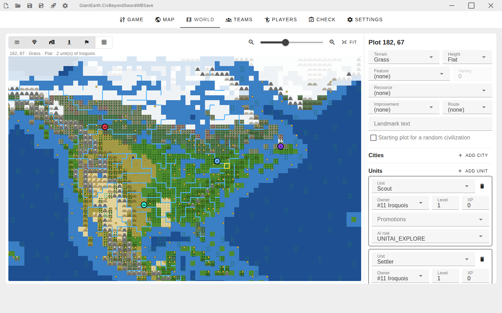
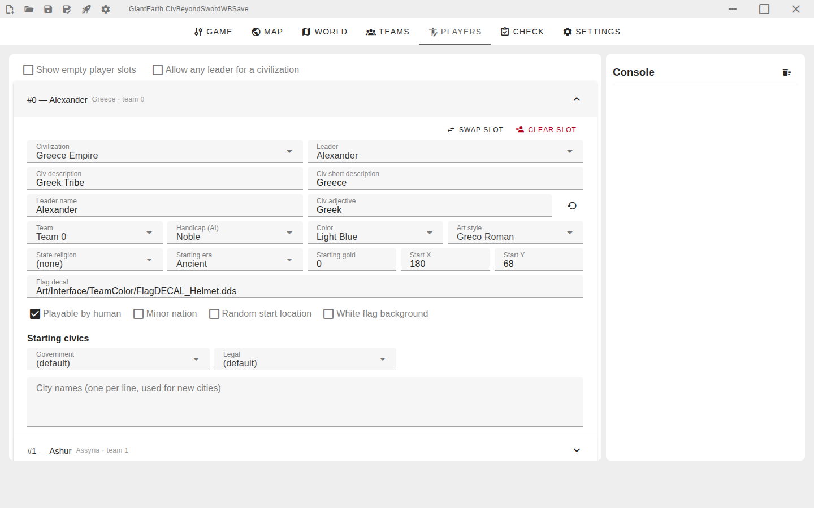
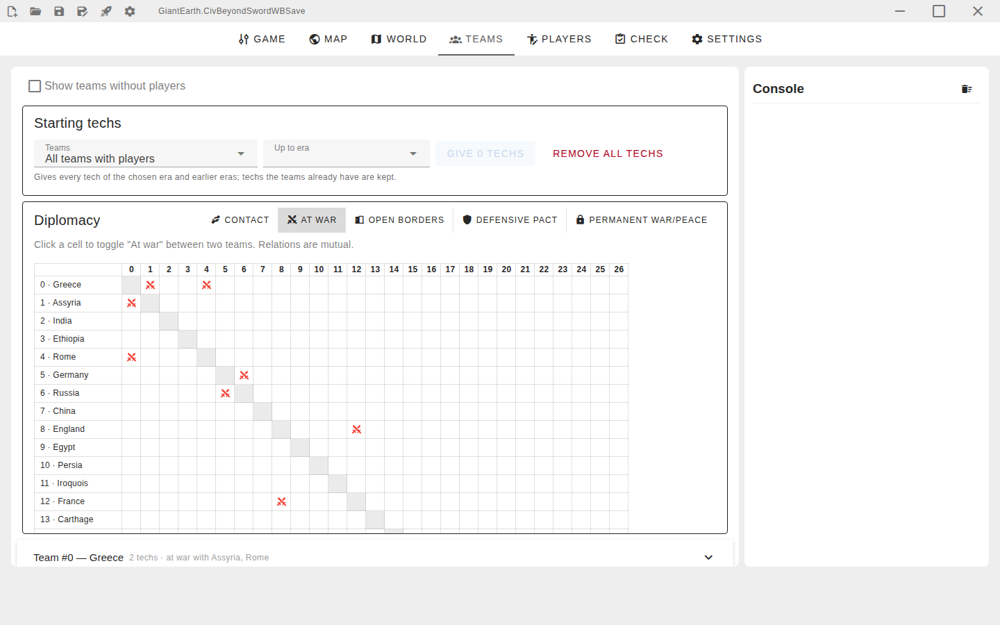
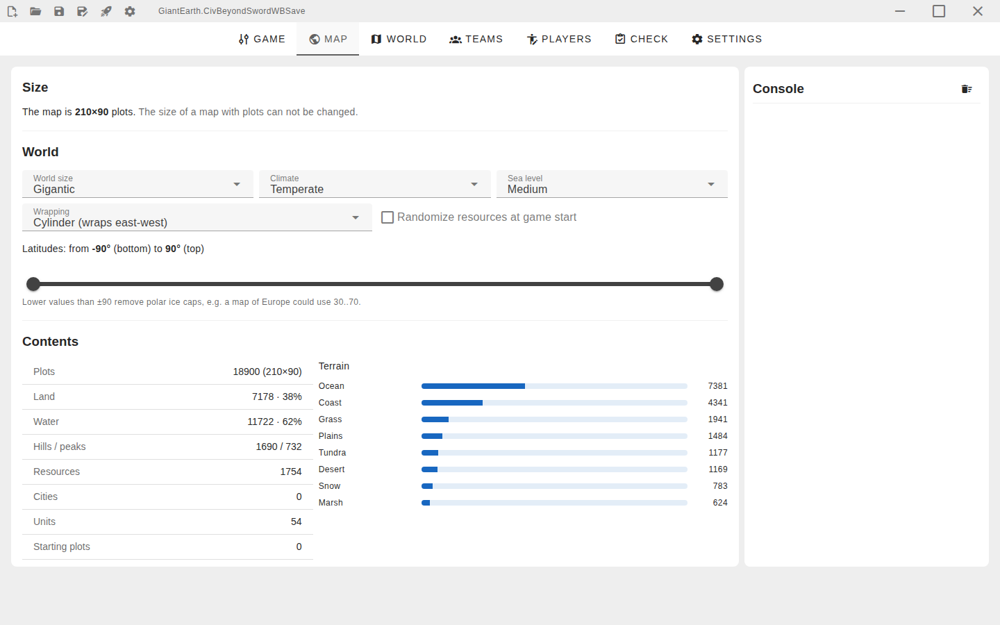
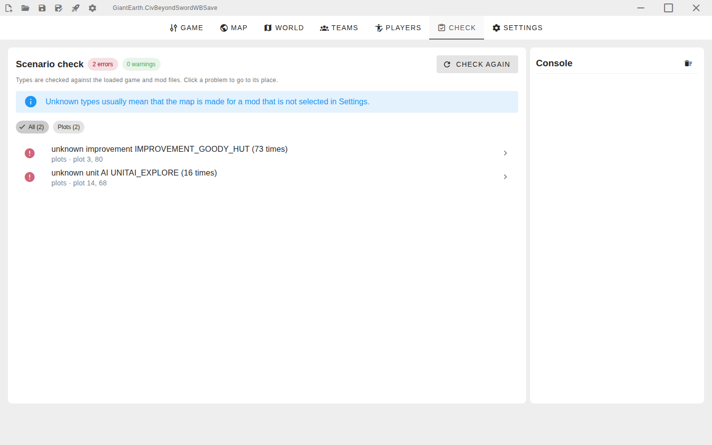
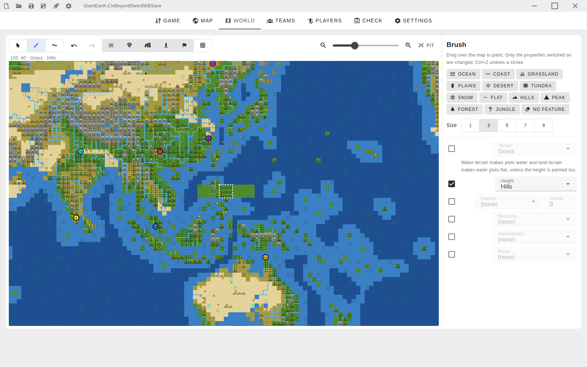

# Civilization 4 Map Studio

Welcome to the **Civilization 4 Map Studio**! This tool is designed to help you in editing and creating custom maps
and scenarios for [Civilization 4: Beyond the Sword](https://en.wikipedia.org/wiki/Civilization_IV), turn-based
strategy game.

The editor opens WorldBuilder saves (`*.CivBeyondSwordWBSave`), shows the map and lets you paint terrain, draw rivers
and set up players, teams, diplomacy, cities, units and start positions with the names from the game and your mod
instead of raw identifiers.



## Features

- **World map.** Terrain, hills and peaks, forests and other features, rivers, resources, cities, units and start
  positions in player colors, with zoom and layers. Click a plot to change its terrain, feature, resource, improvement
  and route, or to add and edit cities, units and signs (texts on the map, for everyone or one player). Drag a start
  flag to move a player. A map that wraps east-west can
  be shifted to move the seam out of the way, e.g. to see the Pacific in one piece.
- **Painting.** A brush of size 1–9 paints terrain, height, features, resources, improvements and routes, with presets
  like Ocean, Grassland, Hills or Forest; painting water or land terrain fixes the height. On a wrapping map the brush
  continues across the seam. The fill brush paints a whole connected area of the same terrain and height at once,
  like a lake or a desert. Rivers are added and removed by clicking the edge between two plots.
- **Areas.** Select a rectangle of plots (also across the seam), copy it with `Ctrl+C` and paste it with `Ctrl+V`
  elsewhere or into another map: terrain, height, features, resources, improvements, routes and rivers, optionally
  with cities and units, and mirrored west–east or north–south (rivers follow), e.g. for symmetric multiplayer maps.
  A selection can be filled with the brush or cleared of units or cities.
- **Search.** `Ctrl+F` finds cities, civilizations and leaders (their start positions), signs, landmarks and
  coordinates and jumps to the plot.
- **Map image.** The map can be exported as a PNG picture with the current layers.
- **Undo.** Every change can be undone with `Ctrl+Z` or the toolbar and redone with `Ctrl+Y`, on any tab: strokes and
  plot edits, pasted and filled areas, signs, players, teams, game settings, map properties and size, swapping and clearing of player slots. Typing a name is
  undone at once, not letter by letter.
- **Cities and units.** A city has its name, owner, population, buildings, religions and holy city, production
  (a unit, building, project or process), culture of each player and script data; a unit has its type, owner, level,
  experience, promotions, AI, damage and facing, and can be duplicated. The *Cities and units* tab lists all of them
  with search, an owner filter and sorting; a click opens the plot.
- **Players.** Pick a civilization and a leader from the game or mod data: names, color and art style are filled in
  automatically. Handicap, state religion, starting era, starting civics and city names are editable too. Swap two
  player slots or clear one — units, cities, culture, attitudes and signs follow their players.
- **Teams.** Starting techs and projects, every tech up to an era for all teams at once, and a diplomacy matrix for
  contact, war, open borders, defensive pacts and permanent war/peace.
- **Map.** World size, climate, sea level, wrapping and latitudes, map statistics. A new map gets empty player slots
  and can be filled with ocean plots of the chosen size, ready for the game's WorldBuilder. An existing map can be
  resized: columns and rows are added (as ocean) or cut on any side, while plots, cities, units, start positions and
  signs keep their places.
- **Scenario check.** Unknown types (e.g. from a mod that is not selected, including city production), start positions in water or outside of the
  map, cities and units of empty slots, missing teams and more. Click a problem to go to its place; errors are shown
  before saving.
- **Game settings.** Era, speed, calendar, victory conditions, game and multiplayer options, locked options.
- **Languages.** The interface is in English and Russian (the system language by default). Names of
  civilizations, leaders, techs etc. are shown in any language of the game or mod texts (French, German, a Russian
  localization...), with English for texts that have no translation.
- **Safe saving.** The original file is copied to `<map>.bak` before it is overwritten for the first time, keys the
  editor does not know (e.g. added by mods) are kept as they are, optional autosave every 5 minutes.

Game data is read from the base game, Warlords, Beyond the Sword and the selected mod, the same way the game does it:
a mod file replaces the base file with the same path.

Shortcuts: `Ctrl+N` new map, `Ctrl+O` open, `Ctrl+S` save, `Ctrl+Shift+S` save as, `Ctrl+Z` / `Ctrl+Y` (or
`Ctrl+Shift+Z`) undo and redo changes outside of text fields, `Ctrl+C` / `Ctrl+V` copy and paste areas and `Ctrl+F`
searches on the World tab, `Esc` cancels pasting or the selection, `Ctrl+wheel` zooms the map.

| Players | Teams and diplomacy |
|---|---|
|  |  |
| **Map properties** | **Scenario check** |
|  |  |



## Getting Started

1. Download the archive for your system from [Releases](https://github.com/bssth/civ4-studio/releases) and unpack it.
2. Start the editor. On the first start open **Settings**, choose the *Beyond the Sword* folder (the one with
   `Civ4BeyondSword.exe`) and, if the map is made for a mod, the mod. The editor loads the game data in a few seconds.
   The languages of the interface and of the names from the game are chosen there too.
3. Open a map with `Ctrl+O` (the dialog starts in `PublicMaps`) or create a new one with `Ctrl+N`.
4. Check the **Check** tab before saving, then launch the game with the rocket button.

**Please remember to back up your maps before editing them** — the editor keeps a `.bak` copy, but one more backup
never hurts.

### Notes for your system

- **Windows.** The editor is not signed, so SmartScreen may warn about it: choose *More info → Run anyway*. It uses
  WebView2, which is part of Windows 10 and 11. Launching the game from the editor triggers a UAC prompt.
- **macOS.** The app is not notarized. If macOS says it can not be opened, right-click it and choose *Open*, or run
  `xattr -dr com.apple.quarantine civ4studio.app`.
- **Linux.** WebKitGTK 4.1 is needed (`libwebkit2gtk-4.1-0` and `libgtk-3-0` on Ubuntu 24.04). The game itself runs
  through Wine/Proton, so point the editor to the *Beyond the Sword* folder inside the prefix.

Settings are stored in the user config directory: `%AppData%\civ4-studio\config.json` on Windows,
`~/Library/Application Support/civ4-studio/config.json` on macOS, `~/.config/civ4-studio/config.json` on Linux.

## Building from sources

Clone or download the repository to your local machine. You need:

- Go 1.22–1.24 (Go 1.25+ breaks binding generation of Wails CLI v2.12)
- Node.js 18+ and npm
- The [Wails v2 CLI](https://wails.io/docs/gettingstarted/installation) of the same version as in `go.mod`:
  `go install github.com/wailsapp/wails/v2/cmd/wails@v2.12.0`
- On Linux: the WebKitGTK development packages (`libgtk-3-dev libwebkit2gtk-4.1-dev` on Ubuntu 24.04)

Run the editor in development mode (hot-reload for both frontend and backend):

```bash
$ wails dev
```

Build a production binary for your current platform (on Linux with WebKitGTK 4.1 add `-tags webkit2_41`):

```bash
$ wails build
```

The output binary appears under `build/bin/`. To target another OS, see
[`wails build --help`](https://wails.io/docs/reference/cli) (cross-compilation of the Windows webview backend has its
own requirements).

Run the tests with `go test ./editor/...`.

`wails build` regenerates the TypeScript bindings in `frontend/wailsjs` from the Go code; commit them together with
changes of the bound Go API.

Interface texts live in `frontend/src/i18n/en.ts` and `ru.ts` with the same keys (`ru.ts` is type-checked against
`en.ts`, so a missing key fails the build). Problems of the scenario check come from Go with a code and arguments
and are translated by the frontend; the English message is the fallback.

### Releases

CI builds the editor for Windows, macOS and Linux on every pull request; the archives are attached to the workflow
run. To publish a release, push a version tag:

```bash
$ git tag v1.0.0
$ git push origin v1.0.0
```

The *Release* workflow runs the tests, builds all platforms with the version from the tag (shown in Settings and in
the file properties) and publishes a GitHub release with the archives and generated release notes. Tags with a suffix,
like `v1.1.0-beta.1`, are published as pre-releases.

## Contributing

We welcome contributions to this project. If you would like to contribute, please fork the repository and submit a
pull request. We will review your changes and merge them into the main branch if they are deemed appropriate.

Please follow [Golang styleguide](https://google.github.io/styleguide/go/) and use `gofmt` to format your code.

Using Goland is strongly recommended, but if you are not familiar with it, you can use any other IDE you are
comfortable with.

### Cautions and known problems

1. The first `wails dev` / `wails build` may take a while as Go and npm dependencies are downloaded and compiled.
2. The map view can be shifted only east-west; maps wrapping north-south are shown as they are stored.
3. You may encounter "@todo" markings in the code. You can implement and contribute what is marked, unless otherwise
   explicitly stated in the comment.
4. I love French hot dogs 😋

## Support

For any questions, issues, or suggestions, please feel free to contact us using Issues. Your feedback is valuable in
improving this tool for the Civilization 4 community.

This editor is a work in progress and may contain bugs or incomplete features. Use it at your own risk. We are
continually working to enhance its functionality and reliability.

Happy mapping!
